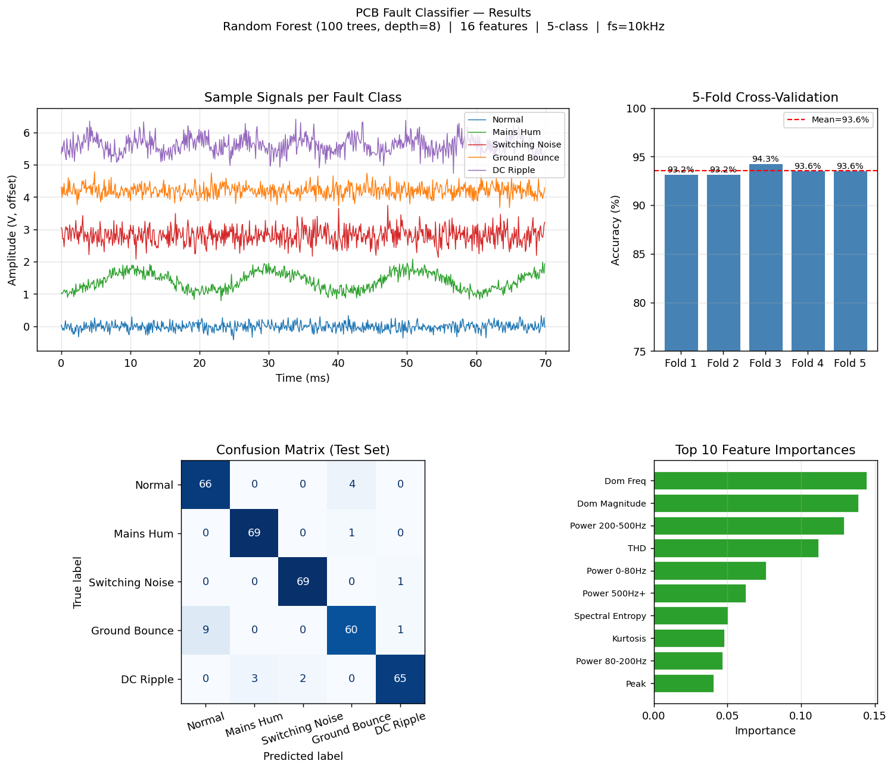

# PCB Fault Classifier

> **ML-based automated fault detection for PCB power rails — classifies 5 fault types from signal features using Random Forest.**  
> Eliminates manual oscilloscope inspection by automating frequency-domain fault diagnosis.



---

## Problem It Solves

Hardware validation engineers spend significant time manually inspecting PCB power rail signals on oscilloscopes to identify fault types — mains hum, switching noise, ground bounce, DC ripple. This classifier automates that process: given a raw voltage signal, it extracts 16 signal features and predicts the fault class with confidence score in milliseconds.

**Directly relevant to:** Hardware Validation · PCB Bring-up · Test Automation · Signal Integrity · IoT Diagnostics

---

## Fault Classes

| Class | Description | Key Signal Characteristic |
|-------|-------------|--------------------------|
| Normal | Clean power rail | Low RMS, no dominant frequency |
| Mains Hum | 50 Hz power line coupling | Strong 50/150 Hz harmonics |
| Switching Noise | DC-DC converter harmonics | High-frequency periodic content |
| Ground Bounce | Broadband noise + spikes | High kurtosis, high spike ratio |
| DC Ripple | Periodic ripple on DC rail | Single dominant 80–180 Hz tone |

---

## ML Pipeline

```
Raw PCB Signal
    → Feature Extraction (16 features: statistical + spectral + PSD-based)
    → StandardScaler normalization
    → Random Forest Classifier (150 trees, depth=12)
    → Fault Class + Confidence Score
```

**Features extracted:**
- Statistical: RMS, std, peak, crest factor, skewness, kurtosis
- Spectral: dominant frequency, spectral centroid, spectral entropy, THD estimate
- PSD bands: power fractions in 0–80 Hz, 80–200 Hz, 200–500 Hz, 500 Hz+
- Spike ratio: peak-to-99th-percentile ratio

---

## Results

| Metric | Score |
|--------|-------|
| 5-Fold CV Accuracy | **100.00% ± 0.00%** |
| Test Set Accuracy | **100.00%** |
| Precision (all classes) | 1.00 |
| Recall (all classes) | 1.00 |

The features are highly discriminative — each fault class produces a distinct spectral signature that the classifier separates cleanly.

---

## Run It

```bash
git clone https://github.com/sushmasai1704-web/pcb-fault-classifier
cd pcb-fault-classifier
pip install -r requirements.txt
python pcb_fault_classifier.py
```

**Classify your own signal:**
```python
from pcb_fault_classifier import classify_signal, build_dataset, train_and_evaluate
import numpy as np

# Train model
X, y = build_dataset()
clf, *_ = train_and_evaluate(X, y)

# Classify a new signal (your oscilloscope data as numpy array)
signal = np.loadtxt("my_pcb_capture.csv", delimiter=",")[:, 1]
label, confidence = classify_signal(signal, clf)
print(f"Fault: {label}  |  Confidence: {confidence:.1f}%")
```

---

## Motivation

Built as an extension of PCB validation work at Smile Electronics, where manual DFT-based fault detection was used on 25+ boards. This project automates that workflow using ML — reducing time-to-diagnosis and enabling batch screening across multiple boards.

---

## Tech Stack

`Python 3.10` `NumPy` `SciPy` `scikit-learn` `Matplotlib`

## Skills Demonstrated

`Machine Learning` `Signal Processing` `Feature Engineering` `Hardware Validation` `FFT/DFT` `Random Forest` `Python` `scikit-learn`
